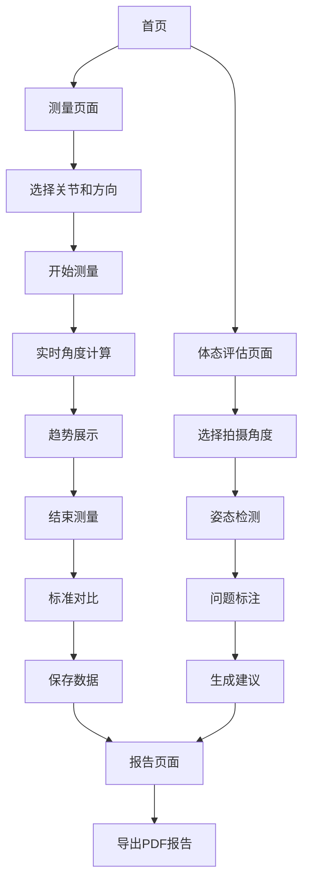

## 1. 产品概述
Vision3是一款基于机器视觉的Web端关节活动度测量与体态评估工具，无需用户注册即可使用，完全在前端完成所有计算，保护用户隐私。
- 解决康复医师、健身教练、运动爱好者对关节活动度和体态问题的精准评估需求
- 通过摄像头实时测量关节活动范围，提供标准化对比和趋势分析
- 市场价值：降低专业评估门槛，提供便捷的数字化评估工具

## 2. 核心功能

### 2.1 用户角色
本产品为单用户工具，无需区分用户角色

### 2.2 功能模块
Vision3包含以下核心页面：
1. **测量页面**：关节选择、方向选择、实时测量、趋势展示
2. **体态评估页面**：正面/背面/侧面体态分析
3. **报告页面**：测量结果展示、趋势图表、报告导出

### 2.3 页面详情
| 页面名称 | 模块名称 | 功能描述 |
|---------|---------|---------|
| 测量页面 | 关节选择器 | 选择要测量的关节部位（颈椎、肩关节、肘关节等） |
| 测量页面 | 方向选择器 | 选择测量方向（前屈、后伸、左侧屈、右侧屈等） |
| 测量页面 | 摄像头预览 | 实时显示摄像头画面，检测人体关键点 |
| 测量页面 | 角度测量 | 实时计算并显示当前关节角度数值 |
| 测量页面 | 趋势图表 | 实时展示角度变化曲线图 |
| 测量页面 | 控制按钮 | 开始测量、停止测量、重置数据 |
| 测量页面 | 标准对比 | 显示当前测量值与标准范围的对比 |
| 体态评估页面 | 视角选择 | 选择拍摄角度（正面、背面、侧面） |
| 体态评估页面 | 姿态检测 | 识别关键体态问题（头部前倾、肩膀不平衡等） |
| 体态评估页面 | 问题标注 | 在图像上标注检测到的体态问题 |
| 体态评估页面 | 建议展示 | 基于检测结果提供改善建议 |
| 报告页面 | 测量摘要 | 显示最大值、最小值、平均值 |
| 报告页面 | 趋势图表 | 展示测量过程中的角度变化趋势 |
| 报告页面 | 标准对比表 | 对比测量结果与标准范围 |
| 报告页面 | 报告导出 | 生成PDF格式的测量报告 |

### 2.4 支持的关节运动列表
系统将支持以下关节及其特定方向的活动度测量：

1. **颈椎 (Cervical Spine)**
   - 前屈 (Flexion)
   - 后伸 (Extension)
   - 左旋 (Left Rotation)
   - 右旋 (Right Rotation)
   - 左侧屈 (Left Lateral Flexion)
   - 右侧屈 (Right Lateral Flexion)

2. **肩关节 (Shoulder)**
   - 左/右前屈 (Flexion)
   - 左/右后伸 (Extension)
   - 左/右外展 (Abduction)

3. **胸腰椎 (Thoracolumbar Spine)**
   - 前屈 (Flexion)
   - 后伸 (Extension)
   - 左侧屈 (Left Lateral Flexion)
   - 右侧屈 (Right Lateral Flexion)

4. **腕关节 (Wrist)**
   - 左/右前屈 (Flexion)
   - 左/右后伸 (Extension)
   - 左/右尺偏 (Ulnar Deviation)
   - 左/右桡偏 (Radial Deviation)

5. **踝关节 (Ankle)**
   - 左/右背屈 (Dorsiflexion)
   - 左/右跖屈 (Plantarflexion)

6. **髋关节 (Hip)**
   - 左/右前屈 (Flexion)
   - 左/右后伸 (Extension)
   - 左/右内收 (Adduction)
   - 左/右外展 (Abduction)
   - 左/右内旋 (Internal Rotation)
   - 左/右外旋 (External Rotation)

7. **膝关节 (Knee)**
   - 左/右前屈 (Flexion)

8. **肘关节 (Elbow)**
   - 左/右前屈 (Flexion)

## 3. 核心流程
用户操作流程：
1. 用户进入测量页面，选择要测量的关节和方向
2. 系统启动摄像头，检测人体关键点
3. 用户开始运动，系统实时计算关节角度
4. 系统记录角度变化，生成趋势图表
5. 测量结束后，显示与标准范围的对比
6. 用户可保存测量数据到本地存储
7. 用户可进入体态评估页面进行静态分析
8. 选择拍摄角度，系统分析体态问题
9. 生成包含测量数据和体态分析的综合报告
10. 导出PDF格式的完整报告

## 4. 用户界面设计

### 4.1 设计风格
- **主色调**：医疗蓝 (#2563eb) + 纯白 (#ffffff)
- **辅助色**：成功绿 (#10b981)、警告橙 (#f59e0b)、错误红 (#ef4444)
- **按钮样式**：圆角矩形，主要操作为实心填充，次要操作为边框样式
- **字体**：系统默认字体，标题18-20px，正文14-16px，标注12px
- **布局风格**：卡片式布局，顶部导航栏，主要内容区分模块展示
- **图标风格**：使用简洁的线性图标，符合医疗科技主题

### 4.2 页面设计概述
| 页面名称 | 模块名称 | UI元素 |
|---------|---------|---------|
| 测量页面 | 顶部控制区 | 关节选择下拉菜单（宽200px），方向选择按钮组（4个方向） |
| 测量页面 | 视频预览区 | 摄像头画面（640x480），关键点覆盖层，半透明角度弧线 |
| 测量页面 | 数据显示区 | 大字体显示当前角度（48px），最大值/最小值标签（16px） |
| 测量页面 | 趋势图表区 | 折线图（宽100%，高200px），实时更新，网格背景 |
| 测量页面 | 对比显示区 | 进度条显示标准范围，当前值指针，颜色编码（正常/异常） |
| 体态评估页面 | 视角选择区 | 三个圆形按钮（正面/背面/侧面），图标+文字 |
| 体态评估页面 | 图像上传区 | 拖拽上传区域（400x300px），或摄像头拍摄按钮 |
| 体态评估页面 | 结果展示区 | 问题列表卡片，严重程度颜色标识，改善建议文本 |
| 报告页面 | 摘要卡片 | 数值大字体展示，标准对比表格，颜色编码状态 |
| 报告页面 | 图表区域 | 全宽趋势图，包含测量时间轴，标准线参考 |
| 报告页面 | 导出控制 | 大按钮"导出PDF报告"，包含日期和测量类型信息 |

### 4.3 响应式设计
- **桌面优先**：主要面向桌面端使用，摄像头和图表展示需要较大屏幕空间
- **平板适配**：1024px以上屏幕完整显示，768px-1024px简化布局
- **移动端**：仅提供基础查看功能，不建议进行测量操作
- **触控优化**：按钮最小44px，增加触控反馈动画