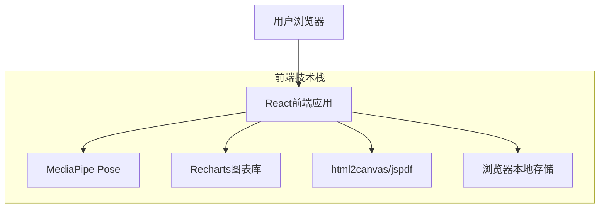

## 1. 架构设计



## 2. 技术描述
- **前端框架**: React@18 + TypeScript + Vite
- **初始化工具**: vite-init
- **UI框架**: Tailwind CSS@3
- **机器视觉**: @mediapipe/pose@0.5
- **图表库**: Recharts@2
- **PDF生成**: html2canvas@1.4 + jspdf@2.5
- **后端**: 无（纯前端实现）

## 3. 路由定义
| 路由 | 用途 |
|------|------|
| / | 首页，功能导航和简要说明 |
| /measure | 关节活动度测量主页面 |
| /posture | 静态体态评估页面 |
| /report | 测量报告展示页面 |
| /guide | 使用指南页面 |

## 4. 核心数据类型定义

### 4.1 关节测量数据类型
```typescript
type JointType = 'cervical' | 'shoulder' | 'thoracolumbar' | 'wrist' | 'ankle' | 'hip' | 'knee' | 'elbow';

type MovementDirection = 
  | 'flexion' | 'extension' 
  | 'abduction' | 'adduction' 
  | 'internal-rotation' | 'external-rotation'
  | 'left-rotation' | 'right-rotation'
  | 'left-lateral-flexion' | 'right-lateral-flexion'
  | 'ulnar-deviation' | 'radial-deviation'
  | 'dorsiflexion' | 'plantarflexion';

interface JointMeasurement {
  id: string;
  jointType: JointType;
  side?: 'left' | 'right'; // 区分左右侧
  direction: MovementDirection;
  measurements: AngleMeasurement[];
  maxAngle: number;
  minAngle: number;
  avgAngle: number;
  standardRange: {
    min: number;
    max: number;
  };
  timestamp: number;
  duration: number; // 测量持续时间（秒）
}

interface AngleMeasurement {
  angle: number;
  timestamp: number;
  confidence: number; // MediaPipe置信度
}
```

### 4.2 体态分析数据类型
```typescript
interface PostureAnalysis {
  id: string;
  viewType: 'front' | 'back' | 'side';
  imageData: string; // base64编码的图像
  keypoints: MediaPipeKeypoint[];
  issues: PostureIssue[];
  analysisTimestamp: number;
}

interface PostureIssue {
  type: 'head-forward' | 'shoulder-imbalance' | 'hip-imbalance' | 'spine-curve';
  severity: 'mild' | 'moderate' | 'severe';
  description: string;
  recommendation: string;
  position: {
    x: number;
    y: number;
  };
}

interface MediaPipeKeypoint {
  name: string;
  x: number;
  y: number;
  z: number;
  visibility: number;
}
```

### 4.3 报告数据类型
```typescript
interface MeasurementReport {
  id: string;
  title: string;
  createdAt: number;
  jointMeasurements: JointMeasurement[];
  postureAnalyses: PostureAnalysis[];
  summary: {
    totalMeasurements: number;
    normalRangeCount: number;
    issuesFound: number;
  };
}
```

## 5. 核心算法实现

### 5.1 角度计算算法
```typescript
// 核心角度计算
export function calculateAngle(
  a: { x: number; y: number },
  b: { x: number; y: number },
  c: { x: number; y: number }
): number {
  const ba = { x: a.x - b.x, y: a.y - b.y };
  const bc = { x: c.x - b.x, y: c.y - b.y };
  
  const dotProduct = ba.x * bc.x + ba.y * bc.y;
  const magBA = Math.sqrt(ba.x * ba.x + ba.y * ba.y);
  const magBC = Math.sqrt(bc.x * bc.x + bc.y * bc.y);
  
  if (magBA === 0 || magBC === 0) return 0;
  
  let cosAngle = dotProduct / (magBA * magBC);
  cosAngle = Math.max(-1, Math.min(1, cosAngle));
  
  return Math.acos(cosAngle) * (180 / Math.PI);
}

// 示例：颈椎前屈计算
// 顶点：ShoulderMid, A: Nose, C: HipMid
function calculateCervicalFlexion(landmarks: any[], width: number, height: number): number {
  // ... implementation using getPixelCoords and calculateAngle
}
```

### 5.2 体态问题检测算法
```typescript
// 检测头部前倾
function detectHeadForward(keypoints: MediaPipeKeypoint[]): PostureIssue | null {
  const nose = keypoints.find(k => k.name === 'nose');
  const leftEar = keypoints.find(k => k.name === 'left_ear');
  const rightEar = keypoints.find(k => k.name === 'right_ear');
  const leftShoulder = keypoints.find(k => k.name === 'left_shoulder');
  const rightShoulder = keypoints.find(k => k.name === 'right_shoulder');
  
  if (!nose || !leftEar || !rightEar || !leftShoulder || !rightShoulder) return null;
  
  // 计算耳朵到肩膀的垂直距离
  const earMidpoint = (leftEar.y + rightEar.y) / 2;
  const shoulderMidpoint = (leftShoulder.y + rightShoulder.y) / 2;
  const verticalDistance = shoulderMidpoint - earMidpoint;
  
  // 正常范围：耳朵应该在肩膀正上方或稍微前方
  if (verticalDistance < -20) { // 负值表示耳朵在肩膀前方
    const severity = verticalDistance < -40 ? 'severe' : verticalDistance < -30 ? 'moderate' : 'mild';
    return {
      type: 'head-forward',
      severity,
      description: `检测到头部前倾约${Math.abs(Math.round(verticalDistance))}像素`,
      recommendation: '建议进行颈部伸展运动，改善坐姿',
      position: { x: nose.x, y: nose.y }
    };
  }
  
  return null;
}
```

## 6. 本地存储设计

### 6.1 存储结构
```typescript
// 使用IndexedDB进行大量数据存储
class LocalStorageService {
  private dbName = 'Vision3DB';
  private version = 1;
  
  async saveMeasurement(measurement: JointMeasurement): Promise<void> {
    const db = await this.openDB();
    const transaction = db.transaction(['measurements'], 'readwrite');
    const store = transaction.objectStore('measurements');
    await store.add(measurement);
  }
  
  async getAllMeasurements(): Promise<JointMeasurement[]> {
    const db = await this.openDB();
    const transaction = db.transaction(['measurements'], 'readonly');
    const store = transaction.objectStore('measurements');
    return store.getAll();
  }
  
  async generateReport(measurementIds: string[]): Promise<MeasurementReport> {
    const measurements = await this.getMeasurementsByIds(measurementIds);
    const analyses = await this.getPostureAnalysesByIds(measurementIds);
    
    return {
      id: generateUUID(),
      title: `测量报告_${formatDate(Date.now())}`,
      createdAt: Date.now(),
      jointMeasurements: measurements,
      postureAnalyses: analyses,
      summary: {
        totalMeasurements: measurements.length,
        normalRangeCount: measurements.filter(m => 
          m.avgAngle >= m.standardRange.min && 
          m.avgAngle <= m.standardRange.max
        ).length,
        issuesFound: analyses.reduce((sum, analysis) => sum + analysis.issues.length, 0)
      }
    };
  }
}
```

## 7. 性能优化策略

### 7.1 MediaPipe性能优化
- 降低检测频率：每3帧进行一次姿态检测
- 降低分辨率：使用480p而非720p进行关键点检测
- 置信度过滤：只处理置信度>0.5的关键点
- 使用WebWorker进行计算密集型任务

### 7.2 内存管理
- 及时清理旧的测量数据
- 使用对象池复用MediaPipe结果对象
- 图表数据采样：超过1000个点时进行数据降采样

### 7.3 渲染优化
- 使用React.memo防止不必要的重渲染
- 虚拟化长列表（历史记录）
- Canvas绘制使用requestAnimationFrame

## 8. 浏览器兼容性
- Chrome 80+ (推荐)
- Firefox 75+
- Safari 13+
- Edge 80+
- 需要WebRTC支持（getUserMedia）
- 需要IndexedDB支持（本地存储）