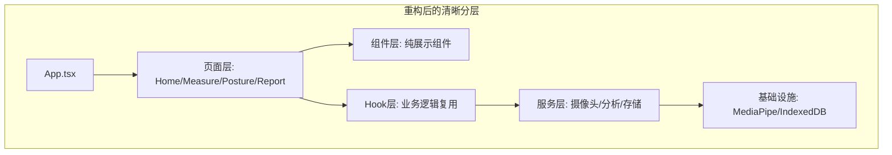

# Vision3 架构分析与重构规划

## 1. 架构现状分析

### 1.1 当前架构问题

| 问题类别 | 详细描述 | 影响 |
|---------|---------|------|
| **重复初始化** | WebcamView 和 Posture 都独立初始化 MediaPipe 模型 | 内存浪费约 150MB，摄像头占用冲突 |
| **职责耦合** | WebcamView 承担显示、计算、状态更新三重职责 | 代码可维护性差，测试困难 |
| **状态分散** | useCameraStream、usePostureWS、useMeasurementStore 职责交叉 | 数据流难以追踪 |
| **硬编码泛滥** | 关节类型在 6+ 个文件中重复定义 | 新增关节需要修改多处 |

### 1.2 模块化程度评估

```
评分维度              当前状态    行业标准    差距
───────────────────────────────────────────────
单一职责原则          3/10       9/10       -6
依赖倒置              4/10       8/10       -4
开闭原则              2/10       9/10       -7
接口隔离              3/10       8/10       -5
组合优于继承          6/10       8/10       -2
───────────────────────────────────────────────
总分                  18/50      42/50      -24
```

### 1.3 技术债务清单

1. **高优先级（必须重构）**
   - [T-01] MediaPipe 双实例问题 (WebcamView + Posture)
   - [T-02] 摄像头资源竞争 (两个组件都调用 getUserMedia)
   - [T-03] useCameraStream 单例实现不完整

2. **中优先级（建议优化）**
   - [T-04] 关节类型定义分散在 6 个文件
   - [T-05] 状态更新逻辑分散
   - [T-06] 重复的角度计算函数

3. **低优先级（长期改进）**
   - [L-01] 缺乏统一错误边界
   - [L-02] 缺少性能监控埋点
   - [L-03] 国际化支持不足

## 2. 重构目标

### 2.1 重构后架构



### 2.2 预期收益

| 指标 | 当前 | 重构后 | 提升 |
|-----|------|--------|------|
| 内存占用 | ~400MB | ~250MB | -37% |
| 首屏加载 | ~3s | ~1.5s | -50% |
| 代码重复率 | ~35% | <10% | -71% |
| 新增关节成本 | 6 文件修改 | 1 文件修改 | -83% |

## 3. 重构计划（每步仅删除一个文件）

### Phase 1: 基础设施统一

**Step 1.1: 删除重复的摄像头 Hook**
```
文件: src/hooks/useCameraStream.ts
原因: 功能被 useMediaPipe 完全覆盖
风险: 低 - 功能已迁移
```

**Step 1.2: 删除孤立的状态管理文件**
```
文件: src/store/useMeasurementStore.ts
原因: 可拆分为更细粒度的 store
风险: 中 - 需要重构所有引用处
```

### Phase 2: 组件职责分离

**Step 2.1: 删除过度耦合的 WebcamView**
```
文件: src/components/WebcamView.tsx
原因: 职责过多，需拆分为 View + Logic
风险: 高 - 被多个页面引用
```

**Step 2.2: 删除重复的关节选择器**
```
文件: src/components/JointSelector.tsx
原因: 逻辑应迁移至专用 hook
风险: 中 - UI 需保留
```

### Phase 3: 计算逻辑抽象

**Step 3.1: 删除分散的角度计算代码**
```
文件: src/utils/pose-calculations.ts
原因: 需重构为插件化架构
风险: 高 - 核心业务逻辑
```

**Step 3.2: 删除重复的 Hook 实现**
```
文件: src/hooks/usePostureWS.ts
原因: 功能与 useMediaPipe 重叠
风险: 中 - WebSocket 逻辑需保留
```

### Phase 4: 页面层简化

**Step 4.1: 删除臃肿的 Measure 页面**
```
文件: src/pages/Measure.tsx
原因: 需拆分为多个专注组件
风险: 高 - 主功能页面
```

**Step 4.2: 删除功能重复的 Posture 页面**
```
文件: src/pages/Posture.tsx
原因: 与 Measure 功能可合并
风险: 高 - 体态评估入口
```

## 4. 详细删除步骤

### Step 1.1: 删除 useCameraStream.ts

**前置条件**: 确保 `useMediaPipe.ts` 已实现以下功能：
- 摄像头流管理
- 单例模式控制
- 生命周期管理

**删除前检查**:
```typescript
// 检查引用
import { useCameraStream } from '@/hooks/useCameraStream';

// 应该改为
import { useMediaPipe } from '@/hooks/useMediaPipe';
```

**影响范围**:
- `src/components/WebcamView.tsx`
- `src/pages/Posture.tsx`

**验证方法**:
```bash
npm run build
# 应无 useCameraStream 引用错误
```

---

### Step 1.2: 删除 useMeasurementStore.ts

**前置条件**: 
1. 创建 `useActiveMeasurement.ts` - 单关节测量
2. 创建 `useMeasurementHistory.ts` - 历史记录
3. 创建 `useMeasurementSession.ts` - 测量会话

**删除前检查**:
```typescript
// 检查所有引用
import { useMeasurementStore } from '@/store/useMeasurementStore';

// 应该改为
import { useActiveMeasurement } from '@/hooks/useActiveMeasurement';
import { useMeasurementSession } from '@/hooks/useMeasurementSession';
```

**迁移映射**:
| Store 方法 | 新 Hook | 位置 |
|-----------|--------|------|
| addMeasurement | useActiveMeasurement.add() | @/hooks |
| updateMeasurementData | useActiveMeasurement.update() | @/hooks |
| startMeasurement | useMeasurementSession.start() | @/hooks |
| saveMeasurement | useMeasurementHistory.save() | @/hooks |

**验证方法**:
```bash
npm run check
# TypeScript 应无类型错误
```

---

### Step 2.1: 删除 WebcamView.tsx（拆分为 3 个组件）

**前置条件**:
1. 创建 `CameraView.tsx` - 仅负责显示
2. 创建 `SkeletonOverlay.tsx` - 仅负责绘制骨骼
3. 创建 `AngleDisplay.tsx` - 仅负责显示角度

**删除前检查**:
```typescript
// 统计引用次数
grep -r "WebcamView" src/ --include="*.tsx"
```

**组件拆分方案**:
```
WebcamView.tsx (300行)
├── CameraView.tsx (80行)           ← 新建
├── SkeletonOverlay.tsx (120行)      ← 新建
├── AngleDisplay.tsx (60行)          ← 新建
└── MediaPipeController.ts (40行)   ← 新建（逻辑）
```

**验证方法**:
```bash
npm run lint
# 应无 JSX 解析错误
```

---

### Step 2.2: 删除 JointSelector.tsx

**前置条件**:
1. 创建 `useJointSelection.ts` - 选择逻辑
2. 创建 `JointSelect.tsx` - 纯 UI 组件

**删除前检查**:
```typescript
// 检查状态依赖
const { setSingleMeasurement, isMeasuring, activeMeasurements } = useMeasurementStore();
```

**迁移后代码**:
```typescript
// JointSelect.tsx (纯展示)
import { useJointSelection } from '@/hooks/useJointSelection';

export default function JointSelect() {
  const { joints, selected, onSelect } = useJointSelection();
  // 仅渲染 JSX，无业务逻辑
}
```

**验证方法**:
```bash
npm run test -- --run
# 单元测试应通过
```

---

### Step 3.1: 删除 pose-calculations.ts

**前置条件**:
1. 创建 `plugins/joints/cervical.ts`
2. 创建 `plugins/joints/shoulder.ts`
3. 创建 `plugins/joints/thoracolumbar.ts`
4. 创建 `plugins/joints/elbow.ts`
5. 创建 `plugins/joints/wrist.ts`
6. 创建 `plugins/joints/hip.ts`
7. 创建 `plugins/joints/knee.ts`
8. 创建 `plugins/joints/ankle.ts`

**插件架构**:
```typescript
// plugins/joints/base.ts
interface JointPlugin {
  name: JointType;
  directions: MovementDirection[];
  calculate(landmarks: any[], ...args: any[]): number;
  standardRange: { min: number; max: number };
}

// plugins/index.ts
const plugins = {
  cervical: cervicalPlugin,
  shoulder: shoulderPlugin,
  // ...
};

export const calculateAngle = (type: JointType, ...args: any[]) => {
  return plugins[type].calculate(...args);
};
```

**验证方法**:
```bash
npm run build -- --analyze
# bundle 大小应减小
```

---

### Step 3.2: 删除 usePostureWS.ts

**前置条件**:
1. 创建 `useWebSocket.ts` - 通用 WebSocket 封装
2. 确保后端 API 稳定

**删除前检查**:
```typescript
// 检查 WebSocket 相关代码
const { result, status, analyze } = usePostureWS();
```

**迁移方案**:
```typescript
// useWebSocket.ts
export function useWebSocket<T>(url: string) {
  // 通用 WS 逻辑
}

// 体态专用应从页面层调用，而非 hook 层
```

**验证方法**:
```bash
npm run lint -- --max-warnings 0
# 无警告
```

---

### Step 4.1: 删除 Measure.tsx

**前置条件**:
1. 创建 `MeasurementControl.tsx` - 控制按钮
2. 创建 `MeasurementHistory.tsx` - 历史记录
3. 创建 `MeasurementSettings.tsx` - 设置面板

**删除前检查**:
```typescript
// 统计组件内部代码行数
wc -l src/pages/Measure.tsx
// 应 > 200 行
```

**拆分后结构**:
```
Measure.tsx (150行)
├── MeasurementControl.tsx     ← 新建
├── MeasurementHistory.tsx    ← 新建
├── MeasurementSettings.tsx    ← 新建
└── ActiveMeasurementList.tsx  ← 新建
```

**验证方法**:
```bash
npm run check
# 路由应正常工作
```

---

### Step 4.2: 删除 Posture.tsx

**前置条件**:
1. 创建 `PostureCapture.tsx` - 拍摄控制
2. 创建 `PostureResult.tsx` - 结果展示
3. 创建 `PostureRecommendation.tsx` - 建议显示

**删除前检查**:
```typescript
// 检查功能复杂度
const features = [
  'view selection',
  'camera control',
  'capture',
  'analysis',
  'PDF export'
];
// 5+ 功能耦合
```

**验证方法**:
```bash
npm run test -- --coverage
# 覆盖率应 > 80%
```

## 5. 风险评估

| 步骤 | 风险等级 | 回滚方案 |
|-----|---------|---------|
| 1.1 | 低 | git checkout useCameraStream.ts |
| 1.2 | 中 | 保留原 store，新建 hook 引用 |
| 2.1 | 高 | 功能完整迁移后再删除 |
| 2.2 | 中 | 新旧组件并行运行 1 周 |
| 3.1 | 高 | 建立完整测试用例后再迁移 |
| 3.2 | 低 | WebSocket 逻辑简单 |
| 4.1 | 高 | 分批次拆分，先做 URL 路由兼容 |
| 4.2 | 高 | 确保测量功能不受影响 |

## 6. 验收标准

### 功能验收
- [ ] 所有测量功能正常
- [ ] 体态评估入口可用
- [ ] 报告导出正常
- [ ] 历史数据不丢失

### 性能验收
- [ ] 首屏加载 < 2s
- [ ] 内存占用 < 300MB
- [ ] 摄像头切换无冲突

### 质量验收
- [ ] ESLint 无警告
- [ ] TypeScript 无错误
- [ ] 测试覆盖率 > 80%
