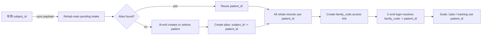

# Patient Identity Contract

Last verified: 2026-06-01

This document defines the patient identity contract for the screening-to-rehab closed loop. It is the source of truth for how `早筛`, `Rehab-main`, and `chatbotagent` should identify the same child across screening, therapist review, parent access, scale tasks, reports, prescriptions, and follow-up tracking.

## 1. Core Decision

The patient is not one loose ID string. The patient is an identity component made of:

- one internal primary identity
- one public patient code
- one or more external aliases
- one or more access credentials
- one profile snapshot for display and matching assistance

The only primary identity for business data is:

- `patient_id`

All assessments, sessions, reports, scale tasks, treatment plans, parent submissions, and tracking records should eventually attach to `patient_id`.

## 2. Field Semantics

| Field | Meaning | Owner | Can be primary key? | Notes |
| --- | --- | --- | --- | --- |
| `patient_id` | Rehab system patient primary identity | `Rehab-main` | Yes | Stable internal ID. All B-end and C-end business records should converge here. |
| `patient_code` / `short_code` | Public four-letter child file code | `Rehab-main` | No | Shared visible code for early screening, therapist workbench, parent-side display, search, visit labels, and handoff. `short_code` is the current compatibility field name. |
| `subject_id` | Early screening subject identity | `早筛` | No | External alias only. It can change by source system and should not own rehab records. |
| `suc` / `display_code` | Human-readable clinical circulation code | `Rehab-main` | No | Good for search, labels, reports, and offline handoff. It may use Luhn validation. |
| `family_code` | Parent / guardian access code | `Rehab-main` | No | Access credential. It should be revocable and preferably expirable. |
| `session_id` | Screening, visit, or assessment event identity | Source app | No | Event ID. It links evidence to a point in time, not to a person by itself. |
| `display_name` | Display name / nickname | Source app or B-end | No | Never use this for identity matching except as assisted UI context. |

## 3. Recommended Identity Shape

```ts
interface PatientIdentity {
  patient_id: string;
  patient_code: string;
  suc?: string;
  profile: {
    display_name: string;
    sex?: 'male' | 'female' | 'unknown';
    age?: number;
    height_cm?: number;
    notes?: string;
  };
  aliases: PatientAlias[];
  access_links: PatientAccessLink[];
  created_at: string;
  updated_at: string;
}

interface PatientAlias {
  source_system: 'early_screening' | 'rehab_main' | 'chatbotagent' | string;
  alias_type: 'subject_id' | 'legacy_patient_id' | 'suc' | string;
  alias_value: string;
  verified: boolean;
  created_at: string;
}

interface PatientAccessLink {
  link_type: 'family_code';
  code_hash?: string;
  status: 'active' | 'revoked' | 'expired';
  linked_to?: string;
  created_at: string;
  expires_at?: string;
}
```

## 4. Closed-Loop Identity Flow



### Stage 1: Early Screening Sync

The early screening terminal should send:

- `subject.subject_id`
- `subject.display_name`
- screening `session_id`
- protocol evidence and report data

It should not invent or own `patient_id`.

After B-end confirmation, early screening may store the returned `patient_code` for cross-terminal display and manual handoff.

### Stage 2: B-End Intake

When `Rehab-main` receives a screening payload:

1. Store it as a pending intake record.
2. Look up `patient_aliases` by `source_system = early_screening` and `alias_value = subject_id`.
3. If found, attach the screening session to the existing `patient_id`.
4. If not found, require B-end action:
   - create a new patient; or
   - link to an existing patient.
5. After B-end confirmation, create the alias mapping.

### Stage 3: B-End Business Records

After intake, the following should use `patient_id`:

- clinical sessions
- posture / Adams / ROM / MedVoice assessments
- formal reports
- scale push tasks
- treatment plans
- assessment summaries
- tracking expectations

`subject_id` may be retained as evidence provenance, but it should not be the join key.

### Stage 4: C-End Access

The parent / guardian app should login with `family_code`, not with `patient_id` or `subject_id`.

Backend resolution should be:

```text
family_code -> active access link -> patient_id -> patient profile and allowed records
```

The C-end store may keep `patient_id` after successful login, but only after the backend has resolved it from a valid access credential.

The C-end may display `patient_code`, but it should not treat it as a login secret.

### Stage 5: C-End Submissions

The C-end should submit:

- `patient_id`
- `session_id` when the task is tied to a specific session
- `task_id` when completing a pushed task
- payload data such as scale answers or tracking records

The backend should reject submissions where `patient_id` does not match the task or access link.

## 5. ID Generation Rules

Recommended `patient_id` format:

```text
pat_<ulid-or-uuid-short>
```

Recommended rules:

- generate `patient_id` only in `Rehab-main`
- never derive `patient_id` from name, `subject_id`, or `family_code`
- do not expose raw database primary keys as public patient IDs
- keep `patient_id` stable for the lifetime of the patient record
- if records are merged, preserve old IDs as `legacy_patient_id` aliases

Recommended `patient_code` format:

```text
Four uppercase letters, for example KJHT
```

Rules:

- generate `patient_code` in `Rehab-main`
- keep it stable for the lifetime of the patient record
- use it for therapist-facing and parent-facing display/search
- use `patient_code-001`, `patient_code-002`, ... as the visible visit code
- do not use it as the parent login credential
- expose `patient_code` in APIs; keep accepting `short_code` during migration

Recommended `suc` / display code format:

```text
QY-<ORG>-<YYMM>-<SEQ>-<CHECK>
```

The display code can be shown to therapists and on reports, but should not be used as the only authorization factor.

Recommended `family_code` format:

```text
4 to 6 uppercase alphanumeric characters
```

The family code should be treated as an access credential:

- store only a server-side hash in `patient_access_links.code`
- allow rotation
- allow revocation
- allow expiration for temporary sharing
- audit binding time and access channel

## 6. API Contract Direction

### Screening Sync Payload

Input from `早筛`:

```json
{
  "session_id": "screen_xxx",
  "subject": {
    "subject_id": "subj_xxx",
    "display_name": "Student Name",
    "sex": "unknown",
    "age": 12,
    "height_cm": 150
  }
}
```

Backend stores this as pending evidence and does not treat `subject_id` as `patient_id`.

### Intake Confirmation

Implemented endpoint:

```http
POST /api/integration/intake/{session_id}/confirm
```

Request:

```json
{
  "action": "create_patient",
  "patient_id": "pat_01HX...",
  "family_code": "AB12CD",
  "family_code_expires_at": "2026-12-31T23:59:59",
  "suc": "QY-ORG-2605-001-X"
}
```

Or:

```json
{
  "action": "link_existing_patient",
  "patient_id": "pat_01HX...",
  "family_code": "AB12CD"
}
```

Response:

```json
{
  "status": "success",
  "session_id": "screen_xxx",
  "patient_id": "pat_01HX...",
  "subject_id": "subj_xxx",
  "family_code": "AB12CD",
  "alias_created": true
}
```

Important storage rule:

- `family_code` can be returned only when B-end creates or rotates it.
- `patient_access_links.code` stores a SHA-256 hash, not the raw family code.
- Existing plaintext family access links are migrated to hashes during integration DB initialization.

### C-End Login

Implemented endpoint:

```http
POST /api/integration/family/login
```

Request:

```json
{
  "family_code": "AB12CD"
}
```

Response:

```json
{
  "patient_id": "pat_01HX...",
  "display_name": "Student Name",
  "allowed_features": ["report", "scale", "plan", "tracking"]
}
```

### B-End Family Access Management

Implemented endpoints:

```http
GET /api/integration/family/access/{patient_id}
POST /api/integration/family/access/{patient_id}/rotate
POST /api/integration/family/access-link/{link_id}/extend
POST /api/integration/family/access-link/{link_id}/revoke
```

Rules:

- list / extend / revoke responses never expose the stored hash
- rotate revokes existing active links and returns the new raw `family_code` once
- C-end login accepts only active, unexpired links
- revoked codes cannot be reactivated by expiry extension

## 7. Migration From Current State

The first compatible implementation slice is now in place:

- `Rehab-main/backend/routers/integration.py` owns `patients`, `patient_aliases`, and `patient_access_links`.
- `POST /api/integration/intake/{session_id}/confirm` binds early-screening `subject_id` aliases to `patient_id`.
- `POST /api/integration/family/login` resolves active, unexpired `family_code -> patient_id`.
- `patient_access_links.code` stores hashed family-code credentials, with init-time migration for old plaintext rows.
- B-end has family-code list, rotate, extend, and revoke API coverage plus a patient-workbench management panel.
- The legacy `/api/integration/subject/link` path has been removed from the runtime C-end login flow.
- Scale, plan, assessment summary, and tracking routes resolve aliases before business reads and writes.
- `chatbotagent` stores the backend-resolved `patient_id` after family-code login.

Remaining migration sequence:

1. Move the remaining B-end local patient model from generic `id` wording toward explicit `patient_id` naming, keeping compatibility aliases during migration.
2. Add audit records for family-code management operations.
3. Expand tests for duplicate screening sync and existing-patient linking.

## 8. Non-Negotiable Rules

- Never use `display_name` as an identity key.
- Never use `family_code` as a database join key.
- Never let early screening own `patient_id`.
- Never attach scale or tracking submissions to a patient by name fallback.
- Always preserve provenance: when evidence comes from early screening, retain `source_system`, `subject_id`, and `source_session_id`.
- Always require B-end confirmation when a new source alias cannot be confidently matched.

## 9. Verification Checklist

- A new early screening subject creates a pending intake, not an immediate final patient identity.
- B-end confirmation creates exactly one `patient_id`.
- Re-syncing the same `subject_id` maps to the same `patient_id`.
- A changed `family_code` still maps to the same `patient_id`.
- A revoked `family_code` cannot access C-end records.
- Scale tasks cannot be submitted with a mismatched `patient_id`.
- Reports and follow-up views group evidence by `patient_id`, not by name or source `subject_id`.
